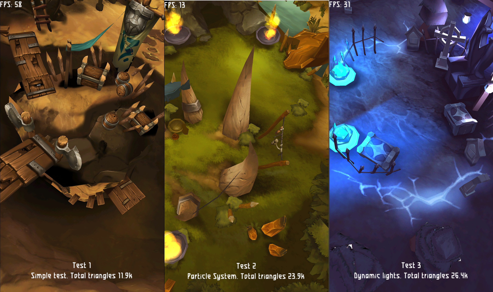

# godot_3d_test
Simple 3d graphics test on GODOT.

This application will allow you to find out the performance for 3D graphics on your device.
The scenes are designed based on the works of 3D 2D Artist Evgeniya Bocharova.

## Build
In the terminal, go to our directory with the project and enter the command:
    
    clickable
    
The project will compile and run on our phone
